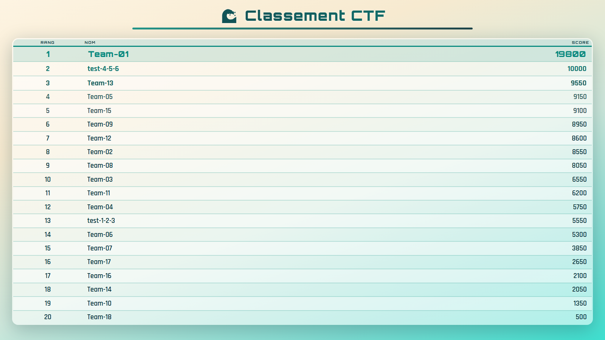

# Classement CTF

Affichage plein écran du classement d'une instance [CTFd](https://github.com/CTFd/CTFd), pensé pour un vidéoprojecteur ou un écran de salle : 20 équipes visibles d'un coup, rafraîchissement automatique, et animation de glissement quand une équipe en dépasse une autre.



## Prérequis

- Python 3.11+
- Une instance CTFd accessible (Docker ou distante)

## Installation

```bash
pip install -r api_new/requirements.txt
```

```bash
cp api_new/.env.example api_new/.env
```

`.env` contient l'adresse de l'instance CTFd :

```
CTFD_URL=http://localhost:8000
```

## Lancement

```bash
python api_new/manage.py runserver 5001
```

Le classement est sur <http://localhost:5001> — Django sert aussi les fichiers statiques du `frontend/`, il n'y a pas de second serveur à démarrer.
