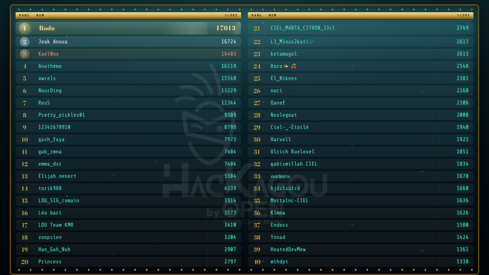

# Classement CTF — double tableau

Affichage plein écran du classement d'une instance [CTFd](https://github.com/CTFd/CTFd), pensé pour un vidéoprojecteur ou un écran de salle : **40 équipes visibles d'un coup**, rangs 1 à 20 à gauche et 21 à 40 à droite. Rafraîchissement automatique, flèches ▲▼ pour qui monte ou descend, et animation de glissement quand une équipe en dépasse une autre — y compris quand elle passe d'une colonne à l'autre.



## Prérequis

- Docker, ou Python 3.11+
- Une instance CTFd accessible (Docker ou distante)

## Configuration

```bash
cp api_new/.env.example api_new/.env
```

`api_new/.env` contient l'adresse de l'instance CTFd :

```
CTFD_URL=https://legacy.hackagou.nc
CTFD_TOKEN=
```

`CTFD_TOKEN` ne sert que si l'instance ne publie pas ses scores. Dans ce cas CTFd redirige les appels anonymes vers sa page de connexion, et la page affiche « Scores non publics sur cette instance CTFd ». Deux façons de débloquer :

- côté CTFd, passer *Admin → Settings → Visibility → Score visibility* sur **Public** ;
- ou générer un jeton dans *Admin → Settings → Access Tokens* et le coller dans `CTFD_TOKEN`.

Le jeton reste côté serveur : le navigateur ne parle qu'à Django, jamais à CTFd. `.env` n'est pas versionné.

## Lancement avec Docker

```bash
docker compose up -d
```

Le classement est sur <http://localhost:5001/double.html>. L'image lit `api_new/.env` au démarrage : après avoir changé `CTFD_URL` ou `CTFD_TOKEN`, relancer avec `docker compose up -d`.

```bash
docker compose down
```

L'image part de `python:3.13-slim`, qui existe aussi en arm64 : la même commande fonctionne sur un Raspberry Pi. Le conteneur redémarre tout seul après une coupure de courant (`restart: unless-stopped`) et se déclare en panne si l'API ne répond plus (`healthcheck`).

## Lancement sans Docker

```bash
pip install -r api_new/requirements.txt
python api_new/manage.py runserver 5001
```

Dans les deux cas, Django sert aussi les fichiers statiques du `frontend/` : il n'y a pas de second serveur à démarrer.

## Les deux pages

| Page | Affichage |
|---|---|
| <http://localhost:5001/double.html> | double tableau, 40 rangs |
| <http://localhost:5001> | tableau simple, 20 rangs |

Ouvrir la page par son adresse `http://localhost:5001/...`, pas en double-cliquant sur le fichier : ouverte en `file:///`, la page ne peut pas joindre Django et reste vide.

[`DOCUMENTATION.md`](DOCUMENTATION.md) détaille le rôle de chaque fichier et les choix de conception.
