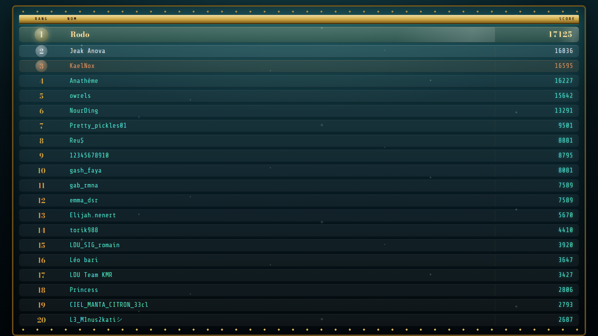

# Classement CTF

Affichage plein écran du classement d'une instance [CTFd](https://github.com/CTFd/CTFd), pensé pour un vidéoprojecteur ou un écran de salle : 20 équipes visibles d'un coup, rafraîchissement automatique, et animation de glissement quand une équipe en dépasse une autre.



## Prérequis

- Python 3.11+
- Une instance CTFd accessible (Docker ou distante)

## Installation

```bash
pip install -r api_new/requirements.txt
```

```bash
cp api_new/.env.example api_new/.env
```

`api_new/.env` contient l'adresse de l'instance CTFd :

```
CTFD_URL=https://legacy.hackagou.nc
CTFD_TOKEN=
```

`CTFD_TOKEN` ne sert que si l'instance ne publie pas ses scores. Dans ce cas CTFd redirige les appels anonymes vers sa page de connexion, et la page affiche « Scores non publics sur cette instance CTFd ». Deux façons de débloquer :

- côté CTFd, passer *Admin → Settings → Visibility → Score visibility* sur **Public** ;
- ou générer un jeton dans *Admin → Settings → Access Tokens* et le coller dans `CTFD_TOKEN`.

Le jeton reste côté serveur : le navigateur ne parle qu'à Django, jamais à CTFd. `.env` n'est pas versionné.

## Lancement

```bash
python api_new/manage.py runserver 5001
```

Le classement est sur <http://localhost:5001> — Django sert aussi les fichiers statiques du `frontend/`, il n'y a pas de second serveur à démarrer.

[`DOCUMENTATION.md`](DOCUMENTATION.md) détaille le rôle de chaque fichier et les choix de conception.
